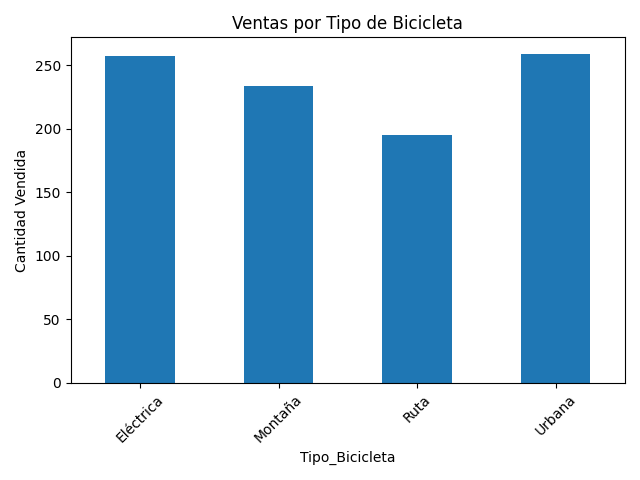
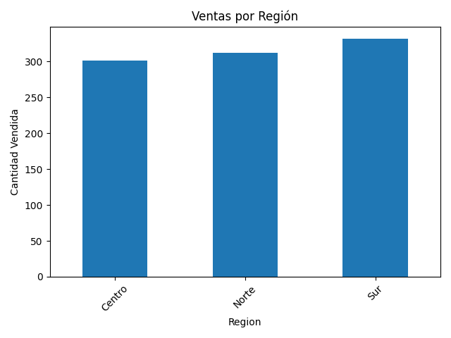
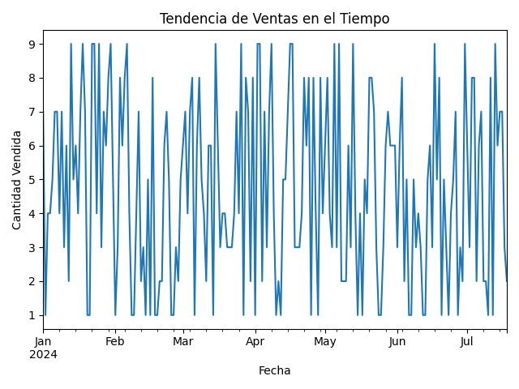

#  Análisis de Ventas de Bicicletas

##  Descripción del proyecto

Este proyecto tiene como objetivo analizar datos históricos de ventas de bicicletas para identificar patrones de compra, productos más vendidos y tendencias comerciales que permitan apoyar la toma de decisiones basadas en datos.

---

##  Objetivos

* Identificar qué tipo de bicicleta presenta mayores ventas
* Analizar el comportamiento de ventas por región
* Evaluar la evolución de ventas en el tiempo
* Generar información útil para la toma de decisiones comerciales

---

##  Comprensión del negocio

Una empresa del rubro de bicicletas busca optimizar sus estrategias comerciales mediante el uso de datos. El análisis permite identificar oportunidades de mejora en ventas, segmentación de clientes y planificación de inventario.

---

##  Dataset

El dataset utilizado contiene información simulada de ventas de bicicletas, incluyendo:

* Fecha
* Tipo de bicicleta
* Cantidad vendida
* Precio
* Segmento de cliente
* Región

 Archivo: `datos/ventas_bicicletas.csv`

---

##  Preparación de datos

Se realizaron las siguientes actividades:

* Conversión de formato de fechas
* Validación de datos nulos
* Agrupación de variables para análisis
* Estandarización de categorías

---

##  Análisis realizado

Se aplicó principalmente **análisis descriptivo**, permitiendo:

* Agrupar ventas por tipo de bicicleta
* Comparar desempeño por región
* Analizar tendencias temporales

---

##  Resultados

###  Ventas por tipo de bicicleta

 **Interpretación:**

* Las bicicletas **Urbana y Eléctrica** presentan el mayor volumen de ventas, con valores muy similares entre sí.
* Las bicicletas de tipo **Montaña** tienen un desempeño intermedio.
* Las bicicletas de tipo **Ruta** muestran el menor nivel de ventas dentro del conjunto analizado.

 **Insight clave:**
Existe una preferencia clara del mercado por bicicletas orientadas a uso urbano y movilidad diaria, lo que sugiere una tendencia hacia soluciones de transporte práctico más que recreativo.

---

###  Ventas por región

 **Interpretación:**

* La región **Sur** presenta el mayor volumen de ventas.
* La región **Norte** mantiene un nivel intermedio.
* La región **Centro** muestra el menor desempeño relativo.

 **Insight clave:**
La demanda no es homogénea geográficamente, lo que indica oportunidades para estrategias comerciales diferenciadas por zona.

---

###  Tendencia de ventas en el tiempo

 **Interpretación:**

* Se observa una **alta variabilidad diaria** en las ventas.
* No se identifica una tendencia claramente creciente o decreciente en el período analizado.
* Existen picos de ventas que podrían estar asociados a eventos específicos o comportamiento de demanda puntual.

 **Insight clave:**
El comportamiento de ventas es volátil, lo que sugiere la necesidad de modelos predictivos o estrategias de planificación dinámica.

---

##  Conclusiones

* Las bicicletas **Urbana y Eléctrica** lideran el mercado, lo que indica una fuerte orientación hacia soluciones de movilidad urbana.
* La región **Sur** representa el mayor potencial de ventas, por lo que se recomienda priorizar estrategias comerciales en esta zona.
* La alta variabilidad en el tiempo evidencia que la demanda no es estable, lo que hace necesario implementar herramientas de predicción para mejorar la planificación.
* El análisis de datos permite identificar patrones clave que pueden optimizar la gestión de inventario, marketing y distribución.

---

##  Recomendaciones

* Aumentar el stock de bicicletas urbanas y eléctricas
* Implementar campañas focalizadas en la región Sur
* Analizar factores externos (estacionalidad, promociones) que expliquen la variabilidad
* Incorporar modelos predictivos para anticipar la demanda

---

## Tecnologías utilizadas

* Python
* Pandas
* Matplotlib
* GitHub

---

##  Estructura del proyecto

analisis-ventas-bicicletas/
│
├── datos/
│   └── ventas_bicicletas.csv
├── imagenes/
│   ├── grafico_tipo.png
│   ├── grafico_region.png
│   └── grafico_tiempo.png
├── cod.py
└── README.md

---

##  Autor

**Roberto Canales Alonso**
Ingeniero en procesos industriales con enfoque en análisis de datos, optimización de procesos y toma de decisiones basada en información.

---
